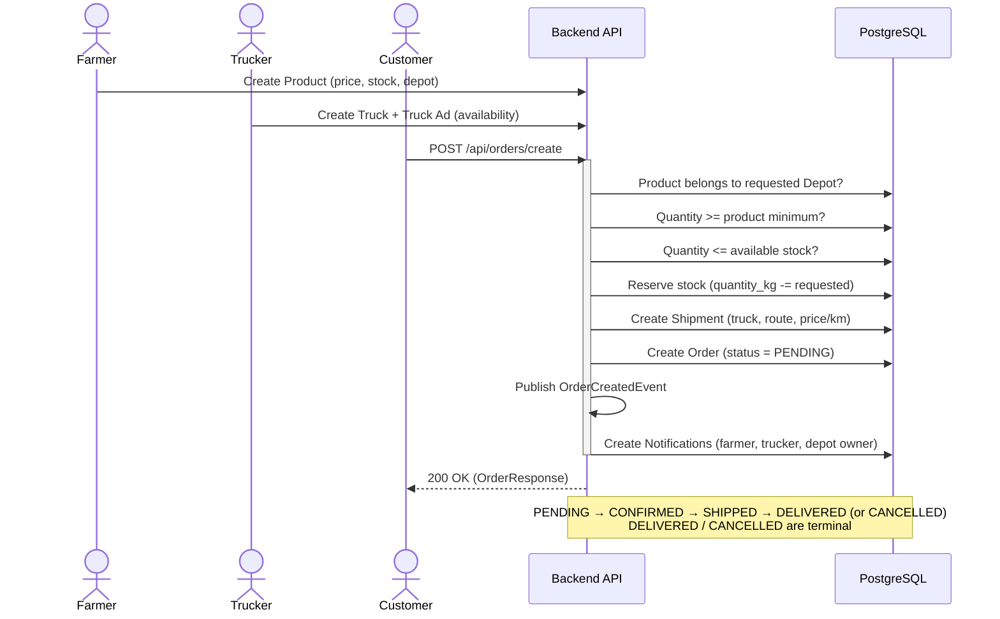
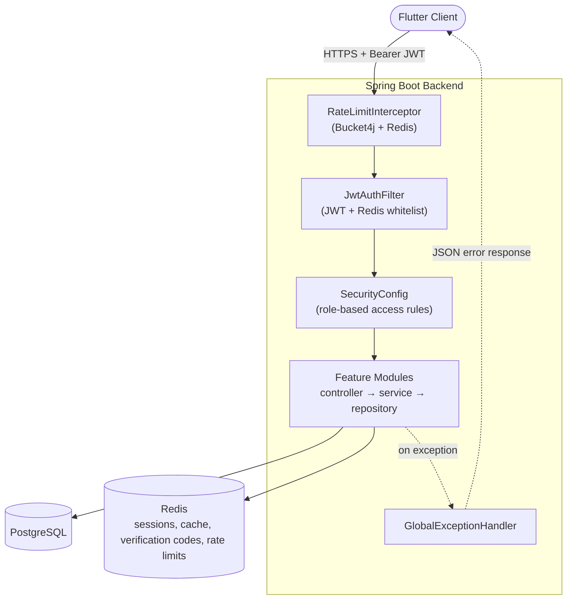
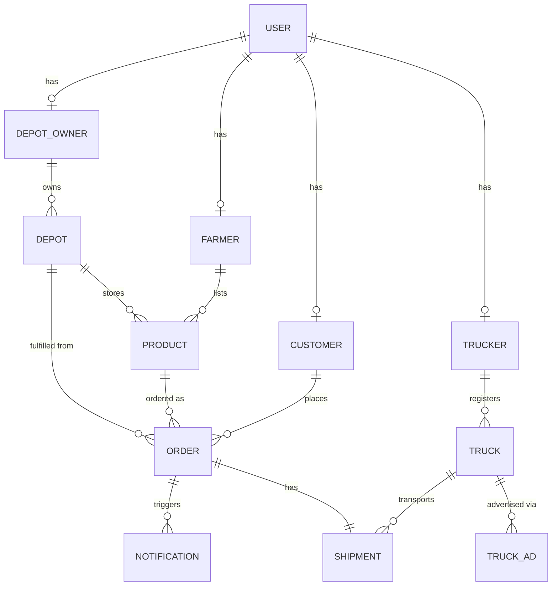
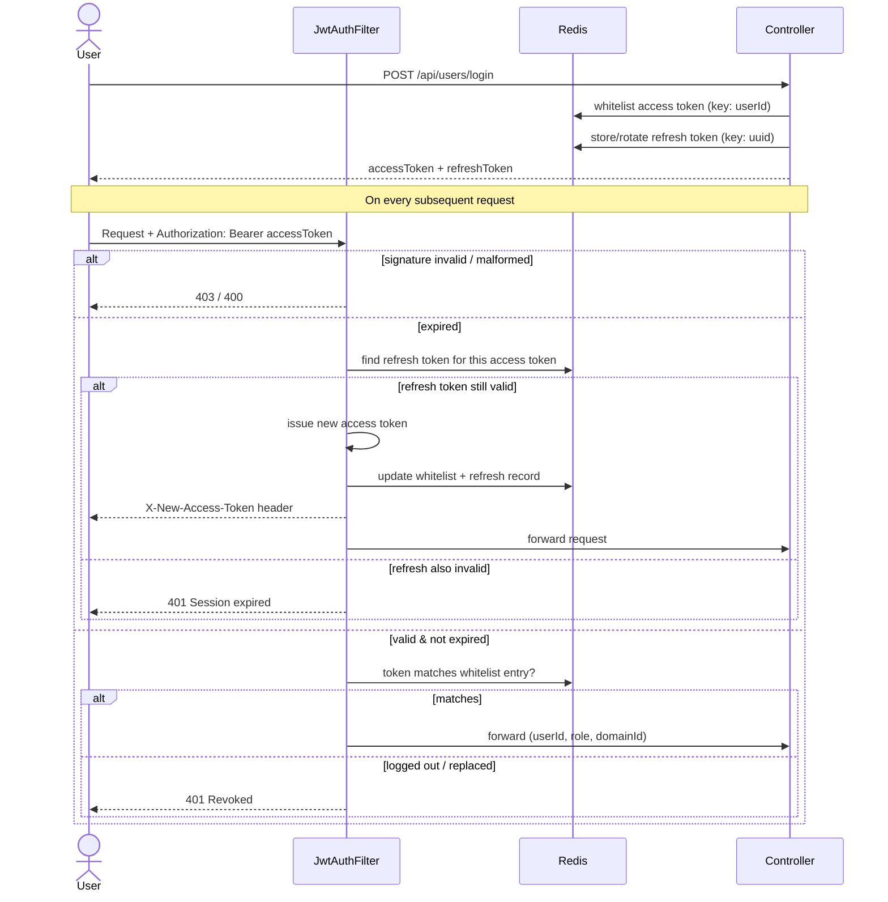
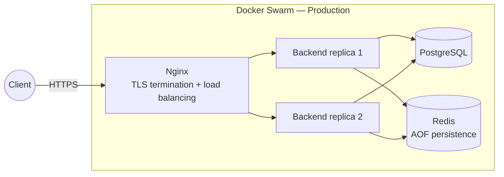

# Tarladan

Tarladan is a digital agricultural marketplace that connects four types of users — farmers, buyers, truckers, and depot (warehouse) owners — directly on one platform, removing the chain of intermediaries that typically sits between a farmer's field and a consumer's table.

The repository contains two applications:

- **`backend/`** — a Java / Spring Boot REST API (modular monolith) that implements the marketplace's business logic, authentication, and data persistence.
- **`frontend/`** — a Flutter application (Android, iOS, Web, Windows, macOS, Linux) that consumes the backend API.

This document focuses primarily on the backend, since that is where most of the system's architecture and business logic lives.

## Table of Contents

1. [Problem & Motivation](#problem--motivation)
2. [User Roles](#user-roles)
3. [Core Business Flow](#core-business-flow)
4. [Architecture](#architecture)
5. [Module Reference](#module-reference)
6. [Technology Stack](#technology-stack)
7. [Authentication & Authorization](#authentication--authorization)
8. [Caching](#caching)
9. [Rate Limiting](#rate-limiting)
10. [Email & Verification Flows](#email--verification-flows)
11. [File Uploads](#file-uploads)
12. [Error Handling](#error-handling)
13. [API Documentation](#api-documentation)
14. [Testing](#testing)
15. [Project Structure](#project-structure)
16. [Infrastructure & Deployment](#infrastructure--deployment)
17. [Getting Started (Local Development)](#getting-started-local-development)
18. [Frontend](#frontend)
19. [Roadmap](#roadmap)
20. [Contributors](#contributors)

## Problem & Motivation

Produce grown by a farmer typically passes through several intermediaries — local collectors, wholesalers, distributors — before it reaches a consumer. Each step adds cost without adding value for the farmer, and the farmer's margin shrinks while the consumer's price grows.

Tarladan digitizes the entire chain in one system: a farmer lists produce, a depot owner offers storage, a trucker offers transport, and a customer buys directly from the farmer. The platform's goal is to shorten that chain — increasing the farmer's income, lowering the price paid by the consumer, and making the logistics of storage and transport easier to coordinate.

## User Roles

The platform has four user roles, defined in a single `UserRole` enum shared across the backend (`FARMER`, `CUSTOMER`, `TRUCKER`, `DEPOT_OWNER`). Every account belongs to exactly one role.

| Role | Description |
|---|---|
| **Farmer** | Lists produce for sale (product name, price per kilogram, quantity in stock, minimum purchase quantity), assigns it to a depot. |
| **Customer** | Browses available produce, places orders, and tracks their own order history. |
| **Trucker** | Registers trucks and publishes availability ads (truck ads) describing when and where a truck is free for a shipment. |
| **Depot Owner** | Registers depots (storage locations) that farmers can attach their products to. |

## Core Business Flow

The order flow is the central transaction of the platform and ties every module together:

1. A **Farmer** registers a **Product** (price per kg, stock quantity, minimum purchase amount) and links it to a **Depot** owned by a Depot Owner.
2. A **Trucker** registers a **Truck** and publishes a **Truck Ad** advertising its availability for a route and date range.
3. A **Customer** browses products and places an **Order** for a given product, quantity, depot, and truck.
4. On order creation, the backend, inside a single transaction:
   - verifies the product actually belongs to the requested depot,
   - verifies the requested quantity is at or above the product's minimum purchase amount,
   - verifies sufficient stock is available and atomically reserves it (decrements `Product.quantity_kg`),
   - computes the total price (`price_per_kg * quantity`),
   - creates a **Shipment** record (pickup/drop-off location, truck, price per km) linked one-to-one to the order,
   - persists the **Order** with status `PENDING`,
   - publishes an `OrderCreatedEvent`.
5. An event listener (`NotificationEventListener`) reacts to `OrderCreatedEvent` and creates **Notification** records for the relevant parties (farmer, trucker, depot owner), so each party sees the new order without polling.
6. As the order progresses, its status moves through `PENDING → CONFIRMED → SHIPPED → DELIVERED`, or is set to `CANCELLED`. `DELIVERED` and `CANCELLED` are terminal — once reached, the order's status can no longer change.



## Architecture

The backend is a **modular monolith**: a single deployable Spring Boot application internally organized into self-contained feature modules, rather than a set of separately deployed microservices. Each module under `modules/` typically follows the same internal layering:

```
modules/<name>/
  controller/   REST endpoints (HTTP layer)
  service/      business logic, transaction boundaries
  repository/   Spring Data JPA repositories
  entity/       JPA entities
  dto/          request/response payloads (never expose entities directly over the wire)
```

This gives the benefits of clear domain boundaries and independent testability without the operational overhead of a distributed system — a good fit for a project at this stage, with a clear path to extracting a module into its own service later if a real scaling need appears.

Cross-cutting concerns that don't belong to a single module live outside `modules/`:

- **`config/`** — Spring `@Configuration` classes (security, CORS, caching, Jackson, OpenAPI, rate-limit buckets).
- **`security/`** — JWT issuing/parsing (`jwt/`) and stateful token/session management, Google token verification (`service/`).
- **`infrastructure/`** — integrations with external systems: outbound email (`mail/`), Redis-backed verification codes (`redis/`), rate-limit bucket resolution (`rateLimit/`).
- **`interceptor/`** — the rate-limiting `HandlerInterceptor`.
- **`exception/`** — a single `@ControllerAdvice` translating exceptions into consistent JSON error responses.
- **`shared/`** — enums and DTOs used by more than one module (`UserRole`, `OrderStatus`, `TokenResponse`, `GoogleUserResponse`).



## Module Reference

| Module | Base path | Responsibility |
|---|---|---|
| `user` | `/api/users` | Registration, login, JWT/refresh issuance, profile lookup. Owns the central `User` entity (credentials, role, verification flags). |
| `verification` | `/api/verification` | Email verification via a 6-digit code stored in Redis with a short TTL. |
| `passwordReset` | `/auth` | Forgot-password flow: request a reset code by email, confirm the code, set a new password — all backed by Redis with TTL-bound, single-use codes. |
| `google` | `/google` | Google OAuth sign-in/sign-up, and linking a Google identity to an existing email/password account. |
| `farmer` | `/farmer` | The farmer's role-specific profile entity, linked one-to-one to a `User`. |
| `product` | `/farmer/product` | Product listings (name, price per kg, stock, minimum purchase quantity, photo, depot assignment). Farmer-owned, publicly browsable. |
| `depot` | `/depot` | Depot (storage location) records, owned by a Depot Owner; products are attached to a depot. |
| `depotOwner` | — | The depot owner's role-specific profile entity. |
| `truck` | `/truck` | A trucker's registered trucks (plate, capacity, photo). |
| `truckAd` | `/truck/ads` | Availability ads a trucker publishes for a truck over a date range and route. |
| `trucker` | `/trucker` | The trucker's role-specific profile entity. |
| `customer` | — | The customer's role-specific profile entity. |
| `order` | `/api/orders` | Order placement and lifecycle (stock reservation, pricing, status transitions), the central transaction tying product, depot, truck, and shipment together. |
| `shipment` | — | The transport leg of an order: origin/destination and price per kilometer, one-to-one with an `Order`. |
| `notification` | `/api/notifications` | In-app notifications generated in reaction to domain events (e.g. a new order), with read/unread state. |

Each role-specific profile entity (`Farmer`, `Customer`, `Trucker`, `DepotOwner`) exists mainly to give every role its own primary key space (a "domain id") separate from the shared `User` id — see [Authentication & Authorization](#authentication--authorization) for why that matters.



## Technology Stack

| Concern | Choice |
|---|---|
| Language / runtime | Java 17 |
| Framework | Spring Boot 3.3.5 (Web, Security, Data JPA, Validation, Mail, Data Redis) |
| Database | PostgreSQL |
| Cache / session store | Redis (via Spring Data Redis / Jedis, plus Lettuce for the rate limiter) |
| Authentication | JWT (`io.jsonwebtoken` / JJWT 0.11.5), stateless HS256-signed access tokens with a Redis-backed refresh/whitelist layer |
| Rate limiting | Bucket4j 8.9.0, backed by Redis via `bucket4j-redis` / Lettuce |
| API documentation | springdoc-openapi (OpenAPI 3 / Swagger UI) 2.6.0 |
| Object mapping boilerplate | Lombok |
| Build tool | Maven |
| Containerization | Docker (multi-stage build), Docker Compose (development), Docker Swarm stack (production) |
| Reverse proxy / TLS | Nginx |
| Testing | JUnit 5, Mockito, AssertJ, Spring Boot Test, Hibernate Validator (for Bean Validation tests) |
| Frontend | Flutter (Dart), targeting Android, iOS, Web, Windows, macOS, and Linux from one codebase |

## Authentication & Authorization

Authentication is stateless and JWT-based, with Redis used to make two things possible that a purely stateless JWT cannot do on its own: **logout** and **safe silent refresh**.

**Token claims.** An access token carries three custom claims, kept short to minimize token size:

| Claim | Meaning |
|---|---|
| `uid` | the user's id in the central `users` table |
| `rol` | the user's role (`FARMER`, `CUSTOMER`, `TRUCKER`, `DEPOT_OWNER`) |
| `did` | the **domain id** — the user's primary key in their role-specific table (`Farmer.id`, `Customer.id`, etc.) |

The `did` claim exists because most business entities (a `Product`, a `Truck`, an `Order`) are owned by a `Farmer`/`Trucker`/`Customer`, not directly by a `User`. Carrying the domain id inside the token lets a controller answer "which farmer/trucker/customer is making this call?" via `@RequestAttribute("domainId")`, without an extra database lookup on every request.

**Login flow** (`POST /api/users/login`):
1. Verify the email/password pair (BCrypt).
2. Reject login if the account's email is not yet verified.
3. Resolve the caller's domain id (`RoleBasedIdService`).
4. Issue a short-lived access token (`jwt.access-token-ttl-minutes`, default 15 minutes) and a long-lived refresh token (`jwt.refresh-token-ttl-days`, default 7 days, a random UUID).
5. Store the access token in Redis keyed by user id (an allow-list / whitelist), and the refresh token in Redis keyed by its UUID, pointing back to `userId:domainId:accessToken`.

**Request authentication** (`JwtAuthFilter`, a servlet filter that runs before every request reaches Spring Security's own filters):
1. If no `Authorization: Bearer <token>` header is present, the request proceeds unauthenticated (public endpoints still work; protected ones are rejected downstream by `SecurityConfig`).
2. The token's claims are parsed and validated. A forged or tampered signature, or a malformed token, is rejected with a specific HTTP status (403 or 400) rather than a generic error.
3. If the access token has expired, the filter attempts a **silent refresh**: it looks up the refresh token associated with the expired access token in Redis, and if it is still valid, transparently issues a new access token and returns it to the client via an `X-New-Access-Token` response header — the caller does not need a separate "refresh" round trip for every expiry.
4. If the token is otherwise valid, the filter checks that it still matches the token stored in Redis for that user — this is what makes **logout** actually invalidate a token: logging out deletes the Redis entry, so the still-cryptographically-valid JWT is rejected on the next request.
5. On success, the caller's identity (`userId`, `role`, `domainId`) is attached to the Spring `SecurityContext` and to the request as attributes, for controllers to read.



**Authorization** is enforced at two levels:
- **Role-based, at the HTTP layer** — `SecurityConfig` maps URL patterns and HTTP methods to required roles (e.g. only `FARMER` may `POST`/`PUT`/`DELETE` under `/farmer/**`, `GET` is open to both `FARMER` and `CUSTOMER`).
- **Ownership, at the service layer** — role membership alone doesn't prove a caller owns the specific resource being modified, so service methods additionally check that the resource's owner id matches the caller's `domainId` (e.g. a customer can only view or list their own orders; a user can only mark their own notifications as read), throwing `SecurityException` (mapped to HTTP 403) otherwise.

**Google Sign-In** (`google` module) verifies the ID token against Google's servers server-side (`VerifyGoogleToken`), then either creates a new account or links the Google identity to an existing email/password account — it never trusts a client-asserted email.

## Caching

Spring's cache abstraction is backed by Redis (`CacheConfig`), with a 20-minute default TTL, JSON value serialization, and null values never cached. `@Cacheable` is applied selectively to read-heavy, rarely-changing lookups (for example, fetching a single truck by id is cached per truck **and** per requesting trucker, so the cache key does not accidentally let one trucker's cached response leak to another trucker's ownership-checked request).

This is separate from the JWT/session state kept in Redis (see above), which uses raw `StringRedisTemplate` operations rather than the Spring Cache abstraction.

## Rate Limiting

Rate limiting uses **Bucket4j** with a Redis-backed distributed bucket store (`RedisBucketConfig`, via Lettuce), so limits are enforced consistently even if the backend runs as multiple replicas (as it does in the production Swarm stack — see below). A single `HandlerInterceptor` (`RateLimitInterceptor`) inspects the request path/method and selects an appropriately sized bucket per client IP:

| Bucket | Applies to | Limit |
|---|---|---|
| Login | `POST /api/users/login` | 5 requests / minute |
| Register | `POST /api/users/register` | 3 requests / minute |
| Password reset request | `POST /auth/password-reset` | 3 requests / hour |
| Resend verification code | `POST /api/verification/resendCode` | 1 / minute **and** 5 / hour |
| Verify / confirm code | verification & password-reset code confirmation | 5 requests / minute |
| Order creation | `POST /api/orders/create` | 10 requests / minute |
| Upload-heavy writes | truck / product create-or-update (multipart) | 10 requests / minute |
| Everything else | any other endpoint | 60 requests / minute |

A request that exceeds its bucket returns `429 Too Many Requests` with a JSON body and an `X-Rate-Limit-Retry-After-Seconds` header telling the client exactly when to retry. Static assets, uploaded files, and the Swagger UI/OpenAPI JSON are excluded from rate limiting entirely.

## Email & Verification Flows

Outbound email (`MailService`) is sent via Gmail SMTP through `spring-boot-starter-mail`, configured entirely through environment variables (no credentials in source control — see [Getting Started](#getting-started-local-development)).

- **Email verification**: on registration, a 6-digit code is generated, stored in Redis against the user's email with a short TTL, and emailed. Submitting the correct code marks the account verified; submitting an incorrect code simply fails and leaves the code and account untouched, so the user can retry — the account is never destroyed by a typo.
- **Password reset**: a similar 6-digit, Redis-backed, TTL-bound, single-use code, requested by email and then confirmed before a new password may be set. Requesting a reset for an email that isn't registered returns the same response as a successful request, without sending an email — this avoids leaking which addresses are registered (an email-enumeration side channel).

## File Uploads

Product and truck photos are uploaded as multipart form data, written to disk (`/app/uploads/productPhotos`, `/app/uploads/truckPhotos`), and served back as static resources under `/uploads/**`. Upload requests are covered by the "upload-heavy" rate-limit bucket above.

## Error Handling

A single `@ControllerAdvice` (`GlobalExceptionHandler`) is the only place exceptions are translated into HTTP responses, so controllers stay free of repetitive try/catch blocks:

| Exception | HTTP status | Notes |
|---|---|---|
| `MethodArgumentNotValidException` | 400 | Bean Validation failures, returned as a `{ "field": "message" }` map |
| `SecurityException` | 403 | Ownership/authorization failures, logged as a warning |
| `IllegalArgumentException` | 400 | Business-rule violations (insufficient stock, not-found lookups, etc.) |
| `HttpMessageNotReadableException` | 400 | Malformed JSON or unrecognized fields in the request body |
| Anything else | 500 | Logged server-side with the full stack trace; the client receives a generic message only, so internal details (SQL errors, stack traces) are never leaked in a response |

## API Documentation

The API is documented with OpenAPI 3 via springdoc, including a configured `bearerAuth` security scheme so the Swagger UI's "Authorize" button can be used directly with a JWT access token.

- Swagger UI: `/swagger-ui/index.html`
- Raw OpenAPI JSON: `/v3/api-docs`

Both are excluded from authentication and rate limiting so the documentation is always reachable.

## Testing

The backend has 42 automated tests (JUnit 5 + Mockito + AssertJ), covering:

- **Entity-level Bean Validation** — constructing an entity with valid/invalid field combinations and asserting the expected constraint violations (`Order`, `Product`, `Truck`, `Shipment`, `Depot`, `TruckAd`, `Customer`, `DepotOwner`, `Farmer`, `Trucker`).
- **Service-level unit tests with mocked dependencies** — verifying actual business logic rather than just that a mock was called, including negative/edge cases: `UserServiceImplTest`, `VerificationServiceTest` (correct vs. incorrect code), `PasswordResetServiceTest` (request/confirm/set-password, including the unknown-email and unverified-code paths), `NotificationServiceTest` (including the ownership check on marking a notification as read), `GoogleServiceTest`.
- A Spring context load smoke test (`TarladanApplicationTests`).

Run the full suite with:

```bash
cd backend
mvn test
```

## Project Structure

```
tarladan/
├── backend/
│   ├── src/main/java/com/gangofthree/tarladan/
│   │   ├── config/            cross-cutting Spring configuration
│   │   ├── exception/         global exception handling
│   │   ├── infrastructure/    mail, redis, rate-limit integrations
│   │   ├── interceptor/       rate-limit HTTP interceptor
│   │   ├── modules/           feature modules (see Module Reference)
│   │   ├── security/          JWT + token/session management
│   │   ├── shared/            cross-module enums and DTOs
│   │   └── TarladanApplication.java
│   ├── src/test/java/...      unit tests, mirroring the main package structure
│   ├── src/main/resources/
│   │   └── application.properties
│   ├── nginx/                 reverse proxy configuration
│   ├── certs/                 TLS certificate mount point (not committed)
│   ├── Dockerfile             multi-stage build (Maven build stage + JRE runtime stage)
│   ├── docker-compose.dev.yml local development stack
│   ├── docker-stack.prod.yml  production Docker Swarm stack
│   └── pom.xml
└── frontend/                  Flutter application (all platforms)
```

## Infrastructure & Deployment

**Build.** The `Dockerfile` is a two-stage build: the first stage runs `mvn clean package` (which also executes the test suite) inside a Maven/Temurin image to produce the jar; the second stage copies only the built jar into a lightweight `eclipse-temurin:17-jdk-jammy` runtime image, so the final image doesn't carry the Maven toolchain or source tree.

**Development** (`docker-compose.dev.yml`): backend + PostgreSQL + Redis + an Nginx container listening locally, all on one Docker network. All secrets (database credentials, JWT signing key, mail credentials) are read from environment variables — see [Getting Started](#getting-started-local-development).

**Production** (`docker-stack.prod.yml`): a Docker Swarm stack with the backend running as **2 replicas** behind Nginx, a single PostgreSQL instance, and a Redis instance with append-only persistence enabled. Rolling updates are configured with `parallelism: 1` and `order: start-first`, so a new replica comes up before the old one is stopped. Because Redis-backed rate-limit buckets and the JWT/session whitelist are shared across replicas, horizontal scaling doesn't break authentication or rate limiting.

**Reverse proxy** (`nginx/default.conf`): terminates TLS (HTTP is redirected to HTTPS), then proxies to the backend service by its Swarm DNS name, so Swarm load-balances requests across replicas. Standard forwarding headers (`X-Real-IP`, `X-Forwarded-For`, `X-Forwarded-Proto`) are set so the backend can see the original client IP — which matters directly for rate limiting, since buckets are keyed by client IP.



Rolling updates start the new replica before stopping the old one (`order: start-first`), and because session/whitelist state and rate-limit buckets live in the shared Redis instance rather than in-memory on a single replica, a request can be served by either backend replica without losing authentication state.

## Getting Started (Local Development)

**Prerequisites:** JDK 17, Maven (or use the Docker Compose flow below and skip a local JDK entirely), Docker and Docker Compose, a Gmail account with an [App Password](https://myaccount.google.com/apppasswords) if you want outbound email to work locally.

1. Copy `backend/.env` and fill in your own local values (or edit it directly) — at minimum a database password, a JWT signing secret, and Gmail credentials for `MAIL_USERNAME`/`MAIL_PASSWORD`. Never use real production credentials in this file, and never commit real secrets.
2. From `backend/`, start the full local stack:

   ```bash
   docker compose -f docker-compose.dev.yml up --build
   ```

   This brings up PostgreSQL, Redis, the backend (port 8080), and a local Nginx (port 81/8443).

3. Alternatively, to run just the backend against a local Postgres/Redis without Docker:

   ```bash
   cd backend
   mvn spring-boot:run
   ```

   (requires the same environment variables the app expects — see `application.properties` — to be present in your shell or IDE run configuration.)

4. Open `http://localhost:8080/swagger-ui/index.html` to explore and try the API.

## Frontend

The `frontend/` directory is a single Flutter codebase targeting Android, iOS, Web, Windows, macOS, and Linux. Notable dependencies include `http` for API calls, `flutter_secure_storage` for storing tokens on-device, `google_sign_in` for the Google auth flow, `image_picker` for photo uploads, `flutter_map` + `latlong2` + `geolocator` for location-based features (e.g. depot/truck locations), and `provider` for state management.

## Roadmap

Items known to be incomplete or planned, rather than accidental gaps:

- Self-service profile management for farmers and truckers (currently minimal placeholder modules).
- Distance-based shipment pricing — `pricePerKm` is currently a flat placeholder rate; real distance calculation (e.g. via the geolocation data already collected on the frontend) is planned.
- Booking-conflict detection for overlapping truck ad date ranges.
- A dedicated administrative role and management dashboard for platform-wide oversight.

## Contributors

| Name | GitHub |
|---|---|
| Ali Koray Ürün | [@korayUrun](https://github.com/korayUrun) |
| Mazlum Emre Girgin | [@mazlumemregirgin](https://github.com/mazlumemregirgin) |
| Şehriban Yaren Öztekin | [@yarennoztekinn](https://github.com/yarennoztekinn) |
